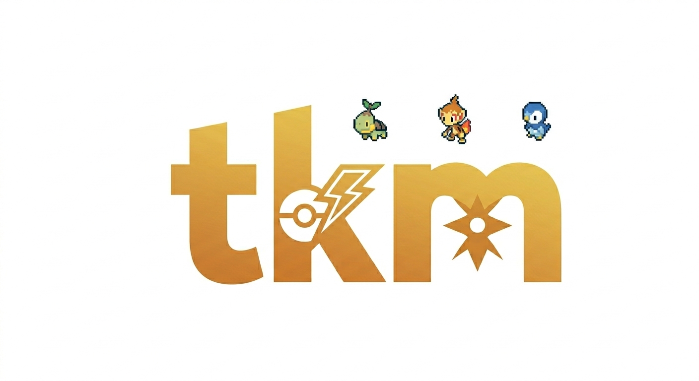

<div align="center">
  
</div>

# Tokénmon (tkm)

> **Spend Tokens. Train Pokémon. Hit the Limit.**

Claude Code에서 토큰 사용량을 포켓몬 성장 루프로 바꿔 주는 게이미피케이션 플러그인입니다. 파티, 도감, 업적, 인카운터, 진화, 그리고 Braille 중심 상태 줄 경험을 제공합니다.

[설치](#install) · [명령어](#core-commands) · [English README](README.md)

## What It Is

Tokénmon은 Claude Code 사용량을 단순 숫자 로그가 아니라 눈에 보이는 성장 루프로 느끼게 만듭니다. 세션은 XP가 되고, 파티는 자라며, 상태 줄은 그 흐름을 계속 보여 줍니다.

## Core Features

- 다양한 터미널에서 안정적으로 동작하는 Braille 중심 상태 줄
- 토큰 사용량을 XP로 전환하는 포켓몬 성장 시스템
- 파티, 박스, 도감, 업적, 인카운터, 진화 시스템
- 세대 전환을 포함한 다세대 데이터 지원
- Claude Code 훅과 연결된 세션 기반 진행 구조

## Install

```bash
/plugin marketplace add ThunderConch/tkm
/plugin install tkm@tkm
/reload-plugins
/tkm:setup
```

## Core Commands

| 명령어 | 설명 |
| --- | --- |
| `/tkm:setup` | 초기 설정 흐름 실행 |
| `/tkm:tkm status` | 현재 파티와 XP 진행도 확인 |
| `/tkm:tkm party` | 활성 파티 상세 보기 |
| `/tkm:tkm pokedex` | 도감 진행도 살펴보기 |
| `/tkm:tkm achievements` | 업적 진행도 확인 |
| `/tkm:tkm config set renderer braille` | 권장 표시 모드로 되돌리기 |

## Documentation

- [개요](docs/ko/overview.md)
- [명령어](docs/ko/commands.md)
- [세대](docs/ko/generations.md)
- [표시 모드](docs/ko/display-modes.md)
- [문서 인덱스](docs/README.md)
- [English README](README.md)

## Fair Warning

버그가 있을 수 있는데, 그냥 Claude한테 고쳐달라고 하면 됩니다. 어차피 얘가 거의 다 만든 거라서요.

## Development

TypeScript와 Claude Code plugin system 위에 구축되어 있습니다.

## License

[MIT](LICENSE)
