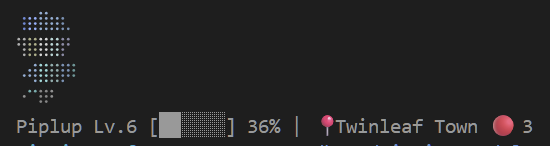

<div align="center">

# Tokénmon (tkm)

**Train Pokémon while you code — XP gamification plugin for Claude Code**

포켓몬 기반 Claude Code 경험치 플러그인

[](LICENSE)
[](https://nodejs.org)

&nbsp;&nbsp;
&nbsp;&nbsp;
&nbsp;&nbsp;
&nbsp;&nbsp;
&nbsp;&nbsp;


</div>

---

<!-- Status bar in action -->
<p align="center">
  
  <br>
  <sub>Status bar with Braille renderer — Kitty/Sixel/iTerm2 renderers available for higher quality</sub>
</p>

## Description

Tokénmon is a multi-generation Pokémon XP gamification plugin for [Claude Code](https://claude.ai/code). Earn XP from your coding sessions to level up, evolve, and catch Pokémon across two complete regions:

- **Generation I (Kanto)**: 151 Pokémon from the original games
- **Generation IV (Sinnoh)**: 214 Pokémon from Diamond/Pearl/Platinum

Switch between generations anytime and build your collection across both worlds.

## Features

| Feature | Details |
|---------|---------|
| **Multi-Generation** | Gen 1 (Kanto, 151 Pokémon) + Gen 4 (Sinnoh, 214 Pokémon); switch anytime |
| **XP Gamification** | Earn XP from coding tokens; authentic 6-group leveling curves |
| **Wild Encounters** | Battle and catch Pokémon during coding sessions |
| **Shiny Pokémon** | Rare sparkle variants (★ 1/512 encounter rate) |
| **Evolution System** | Linear + branching evolutions (e.g., Kirlia → Gardevoir/Gallade) |
| **Friendship & Bonding** | Nickname Pokémon, call them during coding, earn EV bonding |
| **Starter Selection** | Choose from region starters (Gen 1: Bulbasaur/Charmander/Squirtle; Gen 4: Turtwig/Chimchar/Piplup) |
| **Party Management** | 6-member team, box storage, region-optimized party suggestions |
| **Achievements** | 21+ milestone achievements with rare Pokémon unlocks |
| **Pokédex** | Track seen/caught status, browse by type/region/rarity |
| **Legendary Pokémon** | 8 legendaries per generation, unlocked through Pokédex & type mastery |
| **Dashboard** | Full stats, streaks, weekly activity, active events |
| **Terminal Sprites** | ANSI art rendering (Braille, Kitty, Sixel, iTerm2) |
| **Audio Cries** | Authentic Pokémon cries on level-up, evolution, encounters |
| **Events & Boosts** | Time-of-day type bonuses, streak multipliers, milestone encounters |
| **Bilingual** | Full English and Korean (한국어) support |

## Quick Start

### Installation

```bash
# In Claude Code:
/plugin marketplace add ThunderConch/tkm
/plugin install tkm@tkm
/reload-plugins
```

### Setup Wizard

```bash
/tkm:setup
```

The setup wizard guides you through:
1. Dependency installation (`npm install`)
2. Generation selection (Gen 1 Kanto or Gen 4 Sinnoh)
3. Language preference (English or 한국어)
4. Starter Pokémon selection
5. Sprite renderer choice (Braille recommended for compatibility)
6. Status bar display and info modes

After setup, restart Claude Code to see Tokénmon in your status bar.

## Commands

### Core Commands

| Command | Description |
|---------|-------------|
| `/tkm:setup` | Initial setup wizard |
| `/tkm:tkm status` | Show party & XP progress |
| `/tkm:tkm party` | View detailed party info |
| `/tkm:tkm box` | Browse Pokémon storage |
| `/tkm:tkm pokedex` | Search Pokédex (filter by --type, --region, --rarity) |
| `/tkm:tkm achievements` | View achievement progress |
| `/tkm:tkm dashboard` | Full stats and activity dashboard |
| `/tkm:tkm stats` | Weekly & all-time statistics |
| `/tkm:tkm region list` | Explore regions in active generation |
| `/tkm:tkm region move <id>` | Travel to region (e.g., `region move 3`) |
| `/tkm:tkm help` | Full command reference |

### Generation Commands

| Command | Description |
|---------|-------------|
| `/tkm:tkm gen list` | Show available generations |
| `/tkm:tkm gen` | Show active generation |
| `/tkm:tkm gen switch <id>` | Switch generation (e.g., `gen switch gen1`) |
| `/tkm:tkm gen status` | Detailed active gen info |

### Party Management

| Command | Description |
|---------|-------------|
| `/tkm:tkm party add <name>` | Add Pokémon to party |
| `/tkm:tkm party remove <name>` | Remove from party |
| `/tkm:tkm party dispatch <name>` | Set dispatch Pokémon (1.5x XP bonus) |
| `/tkm:tkm party suggest` | Get region-optimized party recommendations |

### Evolution & Development

| Command | Description |
|---------|-------------|
| `/tkm:tkm evolve` | Trigger branching evolution |
| `/tkm:tkm unlock list` | Show unlocked Pokémon |

### Items & Progression

| Command | Description |
|---------|-------------|
| `/tkm:tkm items` | Show held items |
| `/tkm:tkm legendary` | Show legendary Pokémon progress |

### Configuration

| Command | Description |
|---------|-------------|
| `/tkm:tkm config set language <en\|ko>` | Switch language |
| `/tkm:tkm config set renderer <braille\|kitty\|sixel\|iterm2>` | Change sprite renderer |
| `/tkm:tkm config set sprite_mode <all\|ace_only\|emoji_all\|emoji_ace>` | Status bar sprite display |
| `/tkm:tkm config set info_mode <ace_full\|name_level\|all_full\|ace_level>` | Status bar info display |

## Skills

Tokénmon provides these Claude Code skills for convenience:

- **`/tkm:tkm`** — Main CLI commands (status, party, Pokédex, regions, achievements)
- **`/tkm:call`** — Call your Pokémon during coding (bonds & EV system) *(in development)*
- **`/tkm:name`** — Nickname your Pokémon *(in development)*
- **`/tkm:starter`** — Select or view starter Pokémon (used in setup flow)
- **`/tkm:setup`** — Run initial setup wizard
- **`/tkm:doctor`** — Diagnose & fix installation issues

## Generation System

Each generation has its own complete world:

### Generation I (Kanto)
- **Region**: Kanto (관동)
- **Pokédex**: #1–151 (151 total)
- **Starters**: Bulbasaur (이상해씨) / Charmander (파이리) / Squirtle (꼬부기)
- **Regions**: 9 areas (Pallet Town → Indigo Plateau progression)
- **Legendaries**: 8 legendary Pokémon per pokedex milestones

### Generation IV (Sinnoh)
- **Region**: Sinnoh (신오)
- **Pokédex**: #280–493 (214 total)
- **Starters**: Turtwig (모부기) / Chimchar (불꽃숭이) / Piplup (팽도리)
- **Regions**: 9 areas (Twinleaf Town → Spear Pillar progression)
- **Legendaries**: 8 legendary Pokémon per pokedex milestones

**Switching Generations**: Use `/tkm:tkm gen switch <id>` to move between Gen 1 and Gen 4. Your progress in each generation is preserved independently.

## Sprite Renderers

Tokénmon supports multiple terminal sprite rendering formats:

| Renderer | Quality | Compatibility | Notes |
|----------|---------|----------------|-------|
| **Braille** | ASCII art | Universal | Default; works everywhere |
| **Kitty** | Native PNG | Kitty Terminal | Best quality, native graphics |
| **Sixel** | Graphics Protocol | xterm, WezTerm | Good quality; widely supported |
| **iTerm2** | Inline Images | iTerm2 (macOS) | Native iTerm2 support |

Select your preferred renderer during setup. PNG sprites are pre-generated for non-Braille renderers on first use.

## Requirements

- **Claude Code** v2.1 or later
- **Node.js** ≥ 22.0.0
- Internet connection (for PokeAPI assets on first setup)

## Uninstall

To cleanly remove Tokénmon:

```bash
/tkm:uninstall          # Clean up statusLine config & data
/plugin uninstall tkm@tkm
```

**Important**: Run `/tkm:uninstall` before uninstalling the plugin to avoid statusLine errors.

## Troubleshooting

Having issues? Run the diagnostic tool:

```bash
/tkm:doctor             # Check installation & auto-fix common issues
```

The doctor will verify:
- Plugin cache & npm dependencies
- Multi-generation data structure
- StatusLine integration
- CLI commands
- Data integrity (JSON files)
- Asset files (sprites, cries, SFX)
- Save data & starter choice

## Development

Tokénmon is built with:
- **TypeScript** for type-safe game logic
- **Claude Code Plugin System** for seamless integration
- **Terminal ANSI rendering** for cross-platform compatibility
- **Multi-generation data architecture** for scalability

## License

[MIT](LICENSE) — Free to use and modify.

---

**[English Guide](docs/README.en.md)** · **[한국어 가이드](docs/README.ko.md)**
