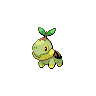

<div align="center">

# 🔴 Tokémon

**Train Pokémon while you code.**

A Gen 4 Pokémon XP gamification plugin for [Claude Code](https://claude.ai/code).
Earn XP from your coding sessions, level up, evolve, and catch 107 Sinnoh-region Pokémon.

[](https://github.com/ThunderConch/tkm/releases/tag/v0.0.3)
[](LICENSE)
[](https://nodejs.org)

**[English Guide](docs/README.en.md)** · **[한국어 가이드](docs/README.ko.md)**

&nbsp;&nbsp;
&nbsp;&nbsp;


</div>

---

<!-- Status bar in action (WSL + Braille renderer) -->
<p align="center">
  
  <br>
  <sub>Status bar with Braille renderer on WSL — Kitty/Sixel/iTerm2 renderers available for higher quality</sub>
</p>

## Quick Start

```bash
# In a Claude Code session:
/plugin marketplace add ThunderConch/tkm
/plugin install tkm@tkm
/reload-plugins
/tkm:setup
```

The setup wizard guides you through dependency install, starter selection (Turtwig / Chimchar / Piplup), and status bar config.

## Highlights

| | |
|---|---|
| **107 Pokémon** | Full Sinnoh Pokédex with 18 types |
| **9 Regions** | Unlock new areas as you catch more |
| **21 Achievements** | Milestone rewards that unlock rare Pokémon |
| **6 XP Groups** | Authentic leveling curves from the original games |
| **Wild Encounters** | Battle and catch Pokémon mid-session |
| **ANSI Sprites** | Terminal-rendered Pokémon art (Braille / Kitty / Sixel / iTerm2) |
| **Cries & SFX** | Audio playback on level-up, evolution, and encounters |
| **i18n** | English and Korean (한국어) fully supported |

## Commands

```
/tkm status          # Party & stats
/tkm party           # Detailed party view
/tkm pokedex         # Browse Pokédex
/tkm region list     # Explore regions
/tkm achievements    # Achievement progress
/tkm help            # Full command list
```

## Requirements

- Claude Code v2.1+
- Node.js ≥ 22.0.0

## Uninstall

```bash
/tkm:uninstall          # Clean up data & statusLine first
/plugin uninstall tkm@tkm
```

## License

[MIT](LICENSE)
